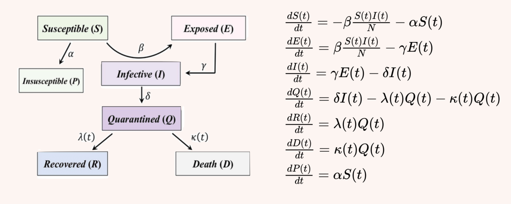

# COVID-19 Fitting & Prediction with generalized SEIR model

app link:https://lexine.shinyapps.io/covid_seir/ (If lost connection, try running it locally)

intro video link:https://drive.google.com/file/d/1SUdbRYqeJOnfbXQx-UOfGWyHnJu1VCtn/view?usp=sharing

## library
* ggplot2
* plotly
* lubridate

## how to use
* Users can choose the location, the maximum number of iteration, and the assumed total population. 
* Click start button to start fitting.  
* After fitting, it plots the fitted recovery and death rate graph, and the comparison graph of the fitted data and real data. 
* If fitting failed, try changing the max iteration or the population. Some regions may not have enough data to fit.

## Model description

Compartmental models simplify the mathematical modelling of infectious disease. They show how individuals move through each compartment in the model, trying to predict things such as how a disease spreads, or the total number infected, or the duration of an epidemic, and to estimate various epidemiological parameters such as the reproductive number. 
Basic models include SIR/SIRS and SEIR/SEIRS models. I chose a more complex model, called generalized SEIR model. 
It has 7 compartments
* S: Suscepetible
* E: Exposed
* I: Infectious
* Q: Quarantined
* R: Recovered
* D: Dead
* P: Insuscepetible

It has 6 parameters

* alpha:  protection rate
* beta:   infection rate
* gamma:  inverse of the average latent time
* delta:   rate at which people enter in ‘quarantine
* lambda:    cure rate
* kappa:    death rate

## Function description
* *epidemic(para,Npop,E0,I0,Q0,R0,D0,t,lambdaFun,kappaFun,fitflag=0)*

  simulates the time-histories of an epidemic outbreak using a generalized SEIR model, 
  
  returns a list containing  target time-histories of the number of cases of 7 compartments
  
* *fit_epidemic(Q,R,D,Npop,E0,I0,tlabel,guess,maxiter)*

  estimates the parameters used in the epidemic function, and returns a list containing 6 parameters and 2 death & recovery functions

* *fitregion(region,tlabel,confirmed,deaths,recovered,maxiter=50,Npop=6e6)*

  main fuction. It calls fit_epidemic() to fit the model, and returns a list containing 3 pics and 6 parameters
  
  3 pics are:
  * p1: recovered rate graph
  * p2: death rate graph
  * p3: all cases graph
